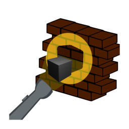
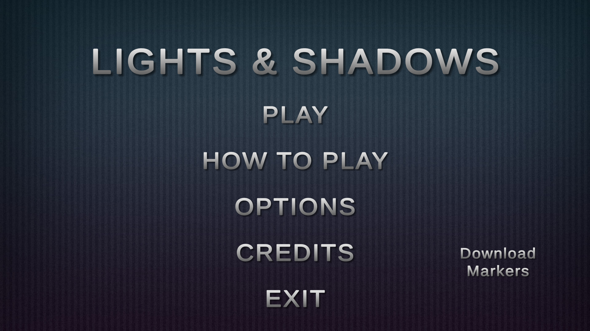
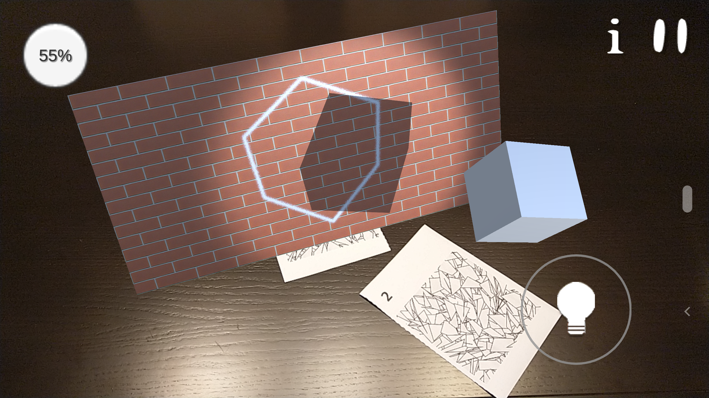

# Lights & Shadows

**Lights & Shadows** is an AR puzzle game made in Unity for Android devices that challenges players with simple yet demanding levels.

## Requirements

This source code requires Unity version 2020.3.24f1 and Git LFS installed.

## How to Install

To install our mobile application, transfer the `.apk` file to your mobile device. This will only work for mobile devices running Android. Do not forget to change the device’s option to allow the installation of software from non-trusted sources. Alternatively, you can build directly from the Unity project into your mobile device, as long as you have USB debugging enabled.

## How to Play

##### The necessary markers are available [here](./markersPrint.pdf) or on the main menu of the game.

When the game starts, a prompt shows the player what markers they will need to use for that level. Upon closing the prompt, the player should point the device’s camera to the markers, after which the virtual objects will be rendered on the screen.

One of these objects will be a rectangular plane with a white outline, representing a wall. The UI has a button with a lightbulb, with the function of positioning a flashlight on the scene, in the same position and rotation of the camera.

The objective of the game is to match the shadows of the objects cast by the flashlight with the white outline on the wall. This can be achieved by moving the markers and positioning the flashlight relative to the wall. The game calculates how close the shadow is to the outline, and gives a percentage in the upper right corner of the screen. To pass the level, this percentage should be equal to or above 80%. Having a higher percentage allows the players to complete the level with more stars.

From time to time, the flashlight will lose energy and turn off. The player will need to shake their device to recharge its energy.

## Credits

### Models
- Flashlight: https://assetstore.unity.com/packages/3d/props/electronics/flashlight-18972
- Pentagrammic Antiprism: https://free3d.com/3d-model/pentagrammic-antiprism-v1--793653.html
- Small Rhombicosidodecahedron: https://free3d.com/3d-model/small-rhombicosidodecahedron-v1--539473.html
- Stellated Truncated Hexahedron: https://free3d.com/3d-model/stellated-truncated-hexahedron-v1--243833.html
### Textures
- Wall Background: https://opengameart.org/content/seamless-brick-textures-bricks001png
### Logo
- Cube: https://commons.wikimedia.org/wiki/File:Cube-with-blender.png
- Flashlight: https://commons.wikimedia.org/wiki/File:Emojione_1F526.svg
- Red Brick Wall: https://freesvg.org/red-brick-wall-with-bricks-sticking-out-vector-clip-art
